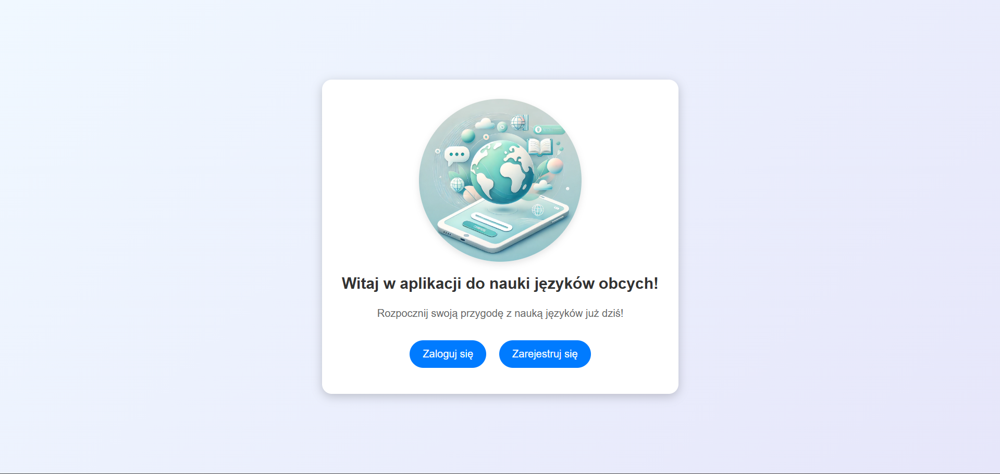
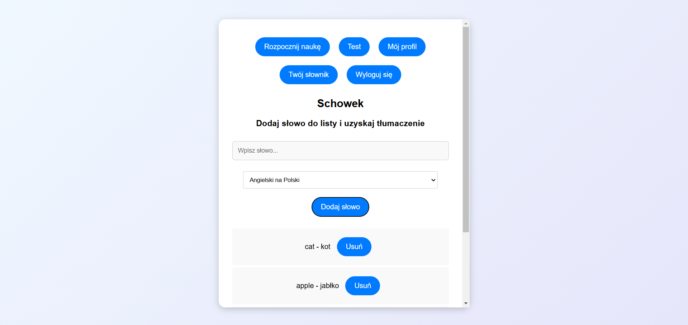
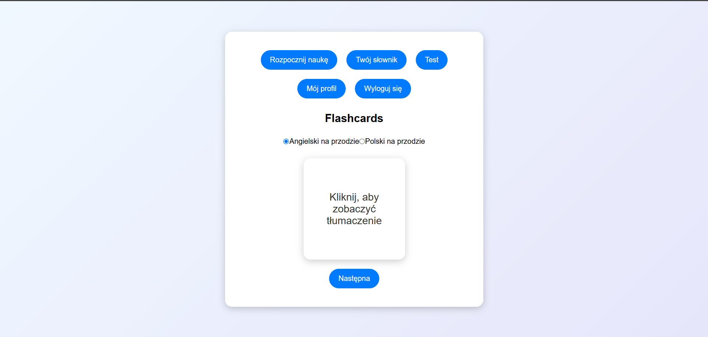
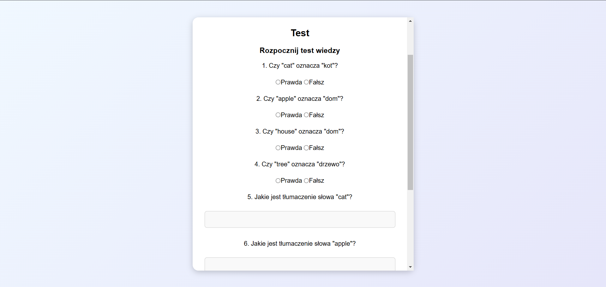

# Language Learning App

A simple and interactive language learning application with two main versions:

1. **Main Branch:** Built using HTML, CSS, and  vanilla JavaScript.'
2. **Master Branch:** A more advanced implementation using Angular for enhanced features and better maintainability.

## Table of Contents

- [Language Learning App](#language-learning-app)
  - [Table of Contents](#table-of-contents)
  - [Project Overview](#project-overview)
  - [Features](#features)
  - [Screenshots](#screenshots)
    - [Welcome Screen](#welcome-screen)
    - [Vocabulary Management](#vocabulary-management)
    - [Flashcards](#flashcards)
    - [Quiz/Test Section](#quiztest-section)
  - [Technologies Used](#technologies-used)
  - [Installation](#installation)
    - [For Main Branch (HTML + JS Version)](#for-main-branch-html--js-version)
    - [For Master Branch (Angular Version)](#for-master-branch-angular-version)

---

## Project Overview

This project is designed to help users learn a new language through:

- Adding vocabulary words to a personal dictionary
- Interactive flashcards
- Vocabulary-based quizzes/tests

The application keeps track of individual user progress and custom vocabulary using local storage.

## Features

- **User Registration & Login:** Each user has their own progress and dictionary.
- **Vocabulary Management:** Add, edit, and delete words in your personal dictionary.
- **Flashcards:** Learn words with interactive flashcards.
- **Tests:** Test your vocabulary knowledge with dynamically generated quizzes.
- **Progress Tracking:** Monitor your completed tests and correct/incorrect answers.

## Screenshots

### Welcome Screen



### Vocabulary Management



### Flashcards



### Quiz/Test Section



## Technologies Used

- **Main Branch:**

  - HTML
  - CSS
  - Vanilla JavaScript

- **Master Branch:**

  - Angular
  - TypeScript
  - SCSS (for enhanced styles)

- **APIs:**
  - **[DeepL API](https://www.deepl.com/docs-api)** : Used for dynamic word translations, allowing users to input vocabulary and receive real-time translations.

## Installation

### For Main Branch (HTML + JS Version)

```bash
# Clone the repository
git clone https://github.com/MariannaSh/Language-Learning-App.git

# Navigate to the main branch
cd language-learning-app

git checkout main

# Open index.html in the browser
```

### For Master Branch (Angular Version)

```bash
# Clone the repository
git clone https://github.com/MariannaSh/Language-Learning-App.git

# Navigate to the project directory
cd my-app

git checkout master

# Install dependencies
npm install

# Run the application
ng serve

# Open http://localhost:4200/ in the browser
```

---

Thank you for checking out this project! We hope it helps you on your language-learning journey 💝

